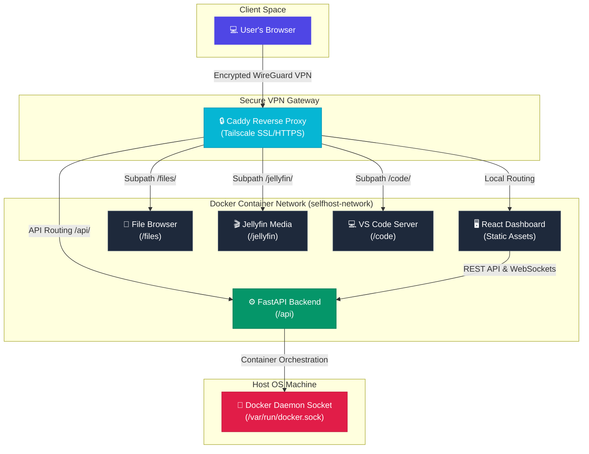

# 🌐 Self Host Tool - Private Portal & App Store

A private, secure, and beautiful dashboard to orchestrate, deploy, and access self-hosted open-source services on a local Mini PC, Home Server, or VPS securely over your **Tailscale VPN (Tailnet)**.

---

## 🚀 Key Features

*   **Sleek Dark Mode Dashboard**: Real-time host telemetry (CPU, Memory, Disk usage, Uptime) and Tailscale status badge.
*   **Zero-Config Security**: Integrates with **Tailscale** for secure WireGuard VPN connectivity and automated Let's Encrypt SSL/HTTPS certificates without exposing open ports on your home router.
*   **Container Isolation**: Standardizes application deployments using **Docker Compose** connected to a shared virtual bridge (`selfhost-network`).
*   **Modular App Store**: Install services (VS Code Server, File Browser, Jellyfin) dynamically from declarative JSON templates.
*   **Host Permission Automation**: Automatically handles Linux directory creation and permission mappings (`chmod 777`) to prevent container startup crashes.

---

## 🛠️ How It Works (Architecture)



1.  **Tailscale VPN Gateway**: All incoming traffic enters securely via your private Tailnet. Your portal is only reachable by devices authenticated on your Tailscale network.
2.  **Caddy Gateway**: Handles automatic HTTPS validation using Tailscale's local certificate API and acts as a secure reverse-proxy routing requests to isolated containers.
3.  **FastAPI Backend**: Communicates directly with the host's `/var/run/docker.sock` to dynamically install, start, stop, and monitor services.

---

## 📦 Getting Started & Installation

### Prerequisites

*   A host machine running **Linux** (e.g., Ubuntu, Debian, or Raspberry Pi OS).
*   A free **Tailscale** account.

### Quick Start (One-Line Install)

Run the following command to clone the repository and kick off the installer:

```bash
git clone https://github.com/Jackson-Brooks/self-host-tool.git && cd self-host-tool && chmod +x installer.sh && sudo ./installer.sh
```

### Step 2: Authenticate Tailscale

During the installation, the script will check if Tailscale is active. If your host machine is not authenticated, it will print a Tailscale auth link. 

> [!IMPORTANT]
> Click the printed link in your browser and authorize the host machine to join your Tailnet to enable secure domain routing and SSL.

---

## 📖 User Guide

### Accessing the Portal

Once the installer finishes, it will output your secure access links:
*   🔗 **Secure Domain**: `https://<your-machine-name>.<your-tailnet-domain>.ts.net` (e.g. `https://ubuntu-desktop.tail5cda40.ts.net`)
*   🔗 **Direct VPN IP**: `http://100.x.x.x`

Open the secure domain in a browser on any device connected to your Tailnet (e.g., your laptop, phone, or tablet).

### App Configurations & Credentials

When deploying apps from the App Store, here are the default behaviors:

#### 📁 File Browser
*   **Default Username**: `admin`
*   **Default Password**: `admin`
*   *Note: File Browser enforces a 12-character minimum password length for any subsequent updates.*

#### 💻 VS Code Server
*   When clicking **Configure & Install**, you will be prompted to set a secure password.
*   Once deployed, navigate to `/code/` and enter your custom password to log in.

#### 🎬 Jellyfin
*   Jellyfin is pre-configured to run under the `/jellyfin/` subpath.
*   Follow the initial setup wizard on your first launch to create your administrator account and map your media library.

---

## 🛠️ App Developer Guide (Adding Apps)

You can expand the portal's App Store catalog by adding custom declarative JSON templates under `backend/templates/`.

### Example App Template (`my-app.json`):
```json
{
  "id": "my-app",
  "name": "My Custom App",
  "description": "Short description of my app.",
  "category": "Utility",
  "icon": "🔧",
  "open_path": "/my-app/",
  "fields": [],
  "compose_template": "version: '3.8'\n\nservices:\n  my-app:\n    image: my-image:latest\n    container_name: selfhost-my-app\n    volumes:\n      - {{APP_DATA_DIR}}/config:/config\n    restart: unless-stopped\n\nnetworks:\n  default:\n    name: selfhost-network\n    external: true\n",
  "caddy_template": "handle /my-app* {\n    reverse_proxy selfhost-my-app:8080\n}\n"
}
```

> [!TIP]
> For more details on template schema rules, dynamic variable substitutions (`{{APP_DATA_DIR}}`, `{{DATA_DIR}}`), and dynamic form fields inputs, open the **Developer Guide** tab directly in your portal workspace or view the compiled guide at `https://<your-domain>/docs.html`.

---

## 🧹 Cleanup & Uninstallation

To stop the portal and cleanly remove all associated containers, networks, volumes, and cached configurations from your host VM:

```bash
docker compose down -v
docker network rm selfhost-network
sudo rm -rf data/ frontend/dist/ .env
```
